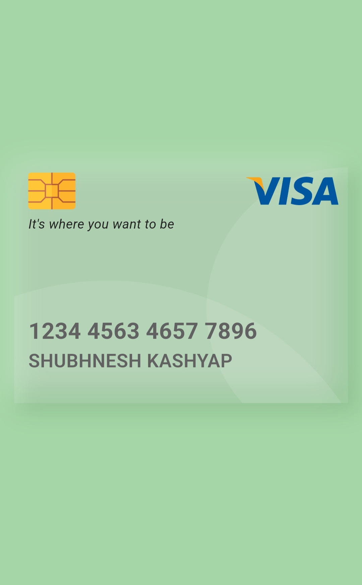

## visa

This project showcases a VISA card UI built with Flutter, utilizing the Stack and Positioned widgets to create a realistic, interactive experience. The card design incorporates a Neumorphism effect, giving it a soft, embossed appearance. It includes essential details like the card number and cardholder name.

## Features
- **Neumorphism Design:** Soft, realistic card design with an embossed effect that mimics physical card textures.
- **Customizable:** Easily modify the card’s colors, fonts, and layout to match your app's branding.
- **Uses Stack & Positioned:** Leverages these Flutter widgets to layer the elements and position them for the neomorphic effect.

